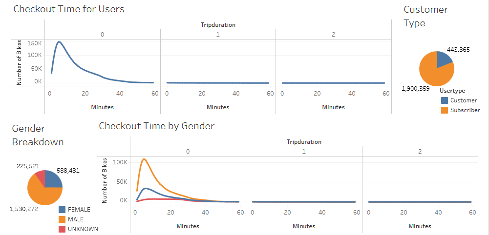

# bikesharing
Dashboard link to citibike visualization with [Tableau Public](https://public.tableau.com/views/bikesharing_16524026126010/citybikeAnalysis?:language=en-US&:display_count=n&:origin=viz_share_link).

## Overview
"The Team" was tasked to review rider data collected by citibike, a bicycle ride share program in New York, to spot marketing trends amid their user base. Of interest was a dataset from 2019 in August, typically a peak time in service utilization. Pulled from the supplied information was a breakdown and visualization with the program Tableau that focused on subscribers, ride duration and hour and weekday peaks by demographics.

## Results
Figure 1.) Composite Dashboard Highlighting Ride Duration, Membership and Demographics.

