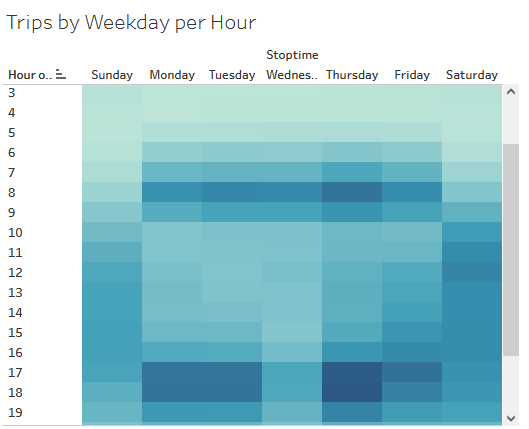
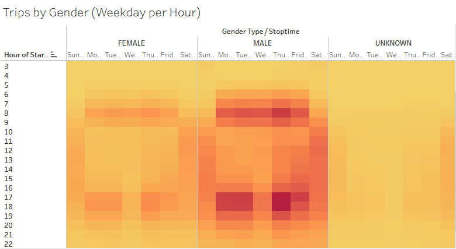
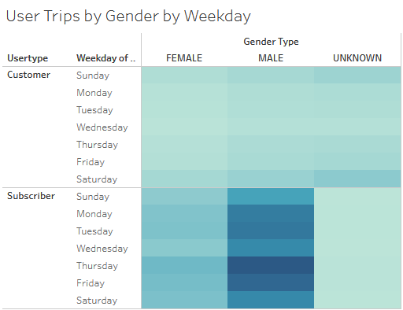

# bikesharing
Dashboard link to citibike visualization with [Tableau Public](https://public.tableau.com/views/bikesharing_16524026126010/citybikeAnalysis?:language=en-US&:display_count=n&:origin=viz_share_link).

## Overview
"The Team" was tasked to review rider data collected by citibike, a bicycle ride share program in New York, to spot marketing trends amid their user base. Of interest was a dataset from 2019 in August, typically a peak time in service utilization. Pulled from the supplied information was a breakdown and visualization with the program Tableau that focused on subscribers, ride duration and hour and weekday peaks by demographics.

## Results
Figure 1.) Composite Dashboard Highlighting Ride Duration, Membership and Demographics.

* Checkout Time for Users displays the ride duration (Tripduration) as a function of bicycle count over a three hour window. The visual result is that most bikes are used for approximatly a 5-minute trip which then rapidly drops off before the 1-hour mark.
* Customer Type highlights that over 80% of the bike ridership's are annual subscribers vs. short-term customers.
* Gender Breakdown showcases the Gender breakdown of ridership. Women account for roughly 25% of the user base.
* Checkout Time by Gender follows Checkout Time for Users in metrics displayed, seperated out by Gender. Of note is that dropoff slope for Women riders is not as steep for Men after the 5-minute peak.

Figure 2.) Trips by Weekday per Hour.

* This heat map indicates that for Monday through Friday, peak bicycle utilization is between 6-9 AM and again at 4-7 PM. Weekends activity shows a rising spread starting around 10 AM, cresting around noon that then tapers off slowly to 7 PM. It can also be inferred that overall usage steadily increases after Thursday leading in to the weekend and drops off on Monday.

Figure 3.) Trips by Gender (Weekday per Hour).

* Parralleling Trips by Weekday per Hour, this heatmap breakdowns by Gender and highlights similar day by day usage. Of note is that Men make a heavy proportion of Weekday ridership.

Figure 4.) User Trips by Gender by Weekday.

* Again, focusing on demographics but now seperating out Annual Subscribers reveals that bicycle usage is predominant with Male Annual Subscribers during the weekdays.

## Summary

An overall

